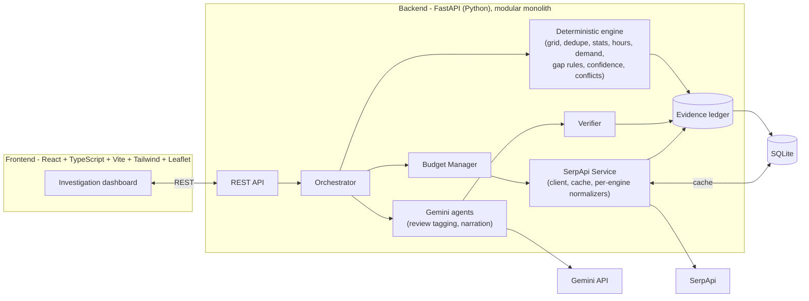

# Nukkad

**Find what your town is searching for but can't find.**

Nukkad detects local market gaps by comparing what a town *has* (Google Maps), what people are *searching for* (Google Trends & Autocomplete), what customers *complain about* (Google Maps Reviews), and what's *changing* (Google News) — then produces evidence-backed **opportunity hypotheses** for small-town entrepreneurs in India.

Built for the **SerpApi India Hackathon 2026** — track: **Commerce & Market Intelligence**.

> Nukkad never claims to predict business success. Every finding is labeled a hypothesis, cites its evidence, and states its confidence and what's missing — see [Language & ethics](#language--ethics).

---

## The problem

A first-time entrepreneur in a tier-2/3 Indian town has almost no tooling to answer "what should I open here?" Site-selection tools exist, but they're built for metros and priced for chains. Google Maps shows what already exists. Google Trends shows what people search. Nobody puts the two together, checks whether existing businesses are actually any good, or notices that half the pharmacies in town close before 9 PM.

## The insight

Opportunity isn't one number — it's a **mismatch**, and it comes in three distinct shapes:

| Gap type | Pattern |
|---|---|
| **Absence** | People need something, and almost nobody supplies it nearby. |
| **Quality** | Supply exists, but customers keep complaining about the same specific thing. |
| **Service-window** | Supply exists, but it's not open when the need actually occurs. |

Nukkad classifies every category into one, more than one, or none of these — and when two signals disagree (e.g. high search interest *and* high competitor density), it says so explicitly rather than averaging the disagreement away.

## Why this isn't a generic AI-chatbot-with-search-button

- **The reasoning is visible.** The Investigation timeline shows the actual SerpApi queries and result counts, live. Every claim in a gap card has a citation chip that opens the real underlying evidence (a Maps listing, a review, a trend series).
- **Deterministic-first.** Grid geometry, deduplication, statistics, hours parsing, demand scoring, gap classification, confidence, and conflict detection are all plain Python — no LLM call can silently change what counts as a gap. The LLM is used only for review-theme tagging and rephrasing an already-verified sentence (see [Agent architecture](#agent-architecture)).
- **A Verifier gate.** Every claim must cite an evidence ID that exists in that scan's ledger, or it is dropped and counted ("N claims removed, unverifiable" is a visible feature, not a hidden failure mode).
- **Conflicts are a first-class feature**, not noise to hide.
- **A real credit budget.** A hard per-scan cap (Lite/Standard/Deep), a global daily cap, a cross-scan cache, and a live budget meter — because SerpApi credits are not infinite and the product treats them as a real constraint.

---

## Key features

- Enter any Indian town, pick a radius and a scan depth, and get a live, streamed-feeling investigation (the backend runs the full pipeline and the frontend replays the timeline for the demo effect — see [Architecture](#architecture) for why).
- An interactive map with every retrieved place, colored by its category's gap type.
- Opportunity cards for each detected gap, each opening a full evidence breakdown: what exists → what customers say → what people search → what's changing → why we think this → conflicts → confidence & missing information → what to validate next.
- Every fact is a clickable citation chip that opens the real source (engine, query, timestamp, raw data).
- Export any scan as a Markdown memo. Scan history and saved hypotheses persist locally in SQLite.

---

## Architecture



**A deliberate simplification, stated plainly:** the orchestrator runs a scan **synchronously** and returns the complete result — including the full step-by-step timeline — in one response, rather than streaming it over SSE/WebSockets. The frontend then replays that timeline with a short delay per step so the investigation still *feels* live during the demo. This trade-off removes an entire class of streaming-connection bugs from a hackathon-timeline build, at the cost of the user waiting for the full scan (10-40s) before the reveal starts. Upgrading to true SSE streaming is the first item in [Roadmap](#roadmap).

### Request flow
```
POST /api/scans
  → Orchestrator resolves categories, geocodes the town
  → SerpApi Service (Trends, News, Maps, Autocomplete, Reviews) - each call
    gated by the Budget Manager and checked against our own SQLite cache
  → Deterministic engine: dedupe → stats → hours coverage → demand index
    → gap classification → conflict detection → confidence
  → Gemini agents (optional): review-theme tagging, sentence rephrasing
    (numerically constrained - see Agent architecture)
  → Verifier: every claim checked against the evidence ledger
  → ScanResult persisted to SQLite, returned to the frontend
```

---

## SerpApi integration

SerpApi is not bolted on — remove it and there is no product. Five engines, five distinct, non-substitutable signals:

| Engine | Used for | What happens on failure |
|---|---|---|
| `google_maps` | Town geocoding; local supply per category (place, rating, review count, type, **weekly opening hours**) | Retried with backoff; a category that still fails is marked unavailable, **never treated as zero supply** |
| `google_maps_reviews` | Customer complaint themes (native `topics` field + optional LLM tagging on low-rated reviews) | That category's quality gap is skipped and disclosed |
| `google_trends` | Regional (India-wide by default) search interest, batched up to 5 terms per call | Demand falls back to Autocomplete + review density, and the UI discloses the signal is not local |
| `google_autocomplete` | Need-bearing search suggestions ("open 24 hours", "near me", "home delivery") | Skipped, with a small confidence penalty |
| `google_news` | Local catalysts (industrial development, town news) | The "what is changing" section is simply omitted |

Full call-by-call detail — inputs, outputs, transformation, and how each one feeds the gap logic — is in [`docs/serpapi-integration.md`](docs/serpapi-integration.md).

**Credit funnel** (Standard preset, ~90 searches): coarse Trends + News + Maps for every category → prioritize the top categories by a demand/supply mismatch score (free, no credits) → deep Autocomplete + Reviews only for those top categories. See [`docs/credit-strategy.md`](docs/credit-strategy.md) for the full budget breakdown and the three presets.

---

## Agent architecture

Two genuinely LLM-based roles, plus a code-only Verifier. Nothing is an "agent" just to look impressive:

| Role | Type | Responsibility |
|---|---|---|
| Collectors & Analyst engine | **Code** | Grid, dedupe, statistics, hours parsing, demand composite, gap classification, confidence, conflict detection |
| **Voice-of-Customer Analyst** | LLM (Gemini) | Tags complaint themes in de-identified review snippets. Every returned quote is checked as an exact substring of the source review before being trusted; if it isn't, that item is dropped, not "fixed". |
| **Gap Explainer** | LLM (Gemini) | Rephrases an *already-computed, already-verified* sentence for readability. It may not introduce any number not already present in the original — checked automatically, with the deterministic sentence kept as a fallback. |
| **Verifier** | Code | The only path a claim can take into the report: every evidence ID must exist in the ledger, and a banned-phrase guardrail runs on every claim. |

If Gemini is not configured (or a call fails), every one of these falls back to a deterministic path automatically — **the app runs correctly with zero LLM calls.** See [`docs/gap-methodology.md`](docs/gap-methodology.md) for the full gap/confidence/conflict rule tables.

---

## Language & ethics

Nukkad is positioned as detecting **market gaps** and producing **opportunity hypotheses** — never as predicting business success. A banned-phrase guardrail (`backend/app/core/security.py`) runs on every LLM output and is checked by the Verifier before a claim can reach the user; phrases like "guaranteed profit" or "best business to start" are rejected outright rather than rewritten. See `backend/tests/test_verifier.py` and `test_agents.py` for the enforcement tests.

---

## Tech stack

Python · FastAPI · SQLite + SQLAlchemy · httpx · React + TypeScript + Vite · Tailwind CSS v4 · Leaflet/OpenStreetMap · Gemini (via REST, structured JSON output) · pytest. No Docker, no Redis, no microservices — a modular monolith that runs on a modest laptop.

## Repository structure

```
nukkad/
├── backend/
│   ├── app/
│   │   ├── core/            # config, logging (secret redaction), security guardrails, rate limiter
│   │   ├── domain/          # Pydantic schemas shared across the app
│   │   ├── db/               # SQLAlchemy models + session
│   │   ├── services/serpapi/ # the ONLY code that calls SerpApi: client, cache, per-engine normalizers
│   │   ├── planner/          # category taxonomy, geo grid, budget manager
│   │   ├── analysis/         # deterministic engine: dedupe, hours, stats, demand, gaps, confidence, conflicts
│   │   ├── llm/               # Gemini REST client
│   │   ├── agents/            # VoC analyst, Gap explainer, Verifier
│   │   ├── orchestrator/      # runs one full scan end to end
│   │   ├── export/            # Markdown memo export
│   │   └── api/                # FastAPI routes
│   └── tests/                 # unit + fully-mocked end-to-end tests (zero SerpApi credits used)
├── frontend/src/
│   ├── components/            # SetupForm, TimelineView, MapView, GapList, GapDetail, EvidenceChips, ...
│   ├── api.ts, types.ts        # typed API client
│   └── App.tsx
├── scripts/                    # Windows PowerShell setup/run scripts + one-off SerpApi/Gemini key checker
├── docs/                       # architecture, SerpApi integration, gap methodology, credit strategy, security
├── fixtures/                   # sanitized recorded SerpApi/Gemini responses (from verify_api_setup.py)
├── .env.example
└── LICENSE
```

---

## Setup (Windows / PowerShell / VS Code)

**Prerequisites:** Python 3.11+, Node.js 20+, a free [SerpApi account](https://serpapi.com/manage-api-key), and (optionally) a [Gemini API key](https://aistudio.google.com/apikey).

```powershell
git clone <your-fork-url> nukkad
cd nukkad
.\scripts\setup.ps1
```

Then:

1. Open `.env` (created from `.env.example`) and set `SERPAPI_API_KEY`. Optionally set `GEMINI_API_KEY` (leave `GEMINI_MODEL` blank for now).
2. **Recommended before your first real scan** — verify your keys and current API behaviour without guessing:
```powershell
   backend\.venv\Scripts\python.exe scripts\verify_api_setup.py --dry-run   # shows the plan, no calls
   backend\.venv\Scripts\python.exe scripts\verify_api_setup.py             # ~28 real SerpApi credits
```
   This prints the recommended `GEMINI_MODEL` for your key (if Gemini is configured) and saves sanitized fixtures under `fixtures/`. Copy the recommended model into `.env`.
3. Start the backend (in one terminal):
```powershell
   .\scripts\run_backend.ps1
```
   API docs at http://localhost:8000/docs
4. Start the frontend (in a **second** terminal):
```powershell
   .\scripts\run_frontend.ps1
```
5. Open **http://localhost:5173**, enter a town (try `Bhopal, Madhya Pradesh`), pick "Lite" for your first run, and scan.

### Running the tests

```powershell
.\scripts\run_tests.ps1
```

All 40 backend tests use mocked SerpApi/Gemini responses (via `httpx.MockTransport`) — **running them never spends a real credit.** They cover: opening-hours parsing (including overnight ranges and non-ASCII characters), the demand composite, every conflict rule, all three gap types firing and *not* firing, the Verifier's evidence-and-guardrail gate, prompt-injection resistance and numeric-consistency checks in both LLM agents, budget-cap enforcement, and a full mocked end-to-end scan through the real orchestrator and FastAPI app.

---

## Environment variables

See [`.env.example`](.env.example) for the full annotated list. The only two you must set are `SERPAPI_API_KEY` and, optionally, `GEMINI_API_KEY` + `GEMINI_MODEL`.

## Security

- API keys live only in `.env` (server-side), never sent to the frontend, never logged (`core/logging_utils.py` redacts them from every log line).
- All external content (Maps listings, reviews, news, LLM output) is treated as untrusted: sanitized before storage, wrapped in explicit delimiters before reaching an LLM, and rendered as plain React text (never `dangerouslySetInnerHTML`).
- Prompt injection: reviews are marked as DATA in the system prompt; every LLM output is grounded (quotes checked as exact substrings) and numerically constrained before being trusted.
- No arbitrary backend URL fetching — the backend never fetches a URL found in scraped content.
- SQLAlchemy ORM with bound parameters everywhere (no raw SQL string building).
- Rate limiting (`slowapi`, in-process, no Redis) on the scan and geocode endpoints; a hard daily SerpApi credit cap.
- CORS restricted to the configured frontend origin.

## Limitations (stated honestly)

- Demand is a heuristic composite of Trends + Autocomplete + review density, not market research. The UI discloses when a demand read includes a regional (not town-level) Trends signal.
- The default Trends geo is country-level (`IN`) rather than state-level, for reliability — see `docs/serpapi-integration.md` for why and how to change it.
- News catalysts are matched at the town level, not per-category.
- Scans run synchronously (see [Architecture](#architecture)) — a Deep scan can take under a minute.
- SerpApi's exact per-call credit accounting (whether errors/cached SerpApi-side responses are ever billed) was **not independently re-verified** in this repository snapshot — the Budget Manager is deliberately conservative (assumes 1 credit per attempted, non-cached call) so it never under-counts.

## Roadmap

- Stream the investigation over SSE for true real-time progress instead of the batch-then-replay approach.
- Per-category News catalysts.
- Peer-town benchmarking and saved scan comparison over time.
- A confirmed, tested state-level Trends geo per Indian state.

## AI tools used

The product direction, track selection, data model, gap-detection rules, SerpApi call strategy, and credit-budget design were decided before any code was written. Claude (Anthropic) was used as a coding assistant during implementation - writing code and tests against that spec - and the result was run, read, and corrected rather than accepted as-is: a deprecated FastAPI startup pattern, an unused dead-code module, and an inconsistency where the demand signal was mislabeled "state-level" instead of "country-level" were all caught this way and fixed. SerpApi and Gemini response shapes were checked against official documentation and real API calls (`scripts/verify_api_setup.py`) rather than assumed.

Disclosed here per the hackathon's rules.

## SerpApi disclosure

This project uses the [SerpApi](https://serpapi.com) `google_maps`, `google_maps_reviews`, `google_trends`, `google_autocomplete`, and `google_news` engines as a core, non-cosmetic dependency — see [SerpApi integration](#serpapi-integration) above and `docs/serpapi-integration.md` for full detail.

## License

MIT — see [LICENSE](LICENSE).